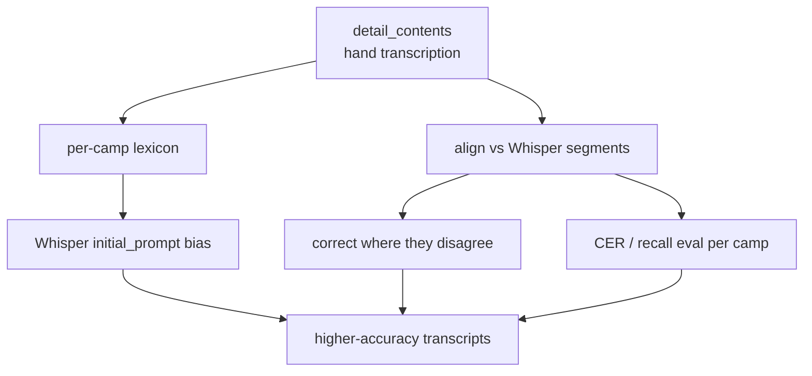

# Catalog enrichment — using the curated sheet to improve RAG & transcription

> **TL;DR.** The client's `Camp Record Export.xlsx` is a 34-year, ~29.5k-row
> human-curated index of the *same* discourse corpus we transcribe. It carries
> facts Whisper can never produce (performers, release references) and facts
> Whisper gets *wrong* (canonical Devanagari titles, exact dates/places). We map
> each sheet row to its audio folder on a **date-anchored join key**, load it
> into standalone catalog tables, and use it two ways: (1) **enrich retrieval**
> with new filters + canonical titles + high-trust text, and (2) **correct
> transcription** by feeding canonical proper nouns back into Whisper and scoring
> Whisper output against the hand transcriptions.
>
> Everything is **additive** — it never rewrites the live index until an explicit,
> opt-in backfill step runs.

---

## 1. What the sheet actually is

One sheet, **29,556 rows × 12 columns**, grain = **one row per track**. The rows
roll up into the same hierarchy the audio folders use:

```
Camp           (CampDate, CampYear, CampPlace)          e.g. Noida, 2010
 └─ Sitting    (Sitting = "7 JAN - 1$ - 6 PM")          3,934 distinct sessions
     └─ Track  (TrackNo, Content, Duration)             ~7.5 tracks / sitting
```

The 12 columns split into three kinds of value:

| Column | Kind | What it gives us |
|---|---|---|
| `CampPlace`, `CampYear`, `CampDate`, `Sitting` | **structured metadata** | when/where — already filterable, but **human-verified** vs. lossy path-parsing |
| `Content` | **canonical title** | the real (80% Devanagari) song/bhajan name — Whisper mangles these |
| `Chorus` | **performers** | singer/chorus credits — *no equivalent anywhere else* |
| `MainComm`, `Comment` | **provenance** | release refs ("Vishvas Vibrations Vol-245") |
| `DetailContents` | **hand transcription** | per-sitting index + transcribed Devanagari passages (mean ~2k chars, up to 14.5k) |
| `TrackNo`, `Duration` | **alignment** | track order + length to line up against audio |

Coverage: **1980–2018**. 1,496 rows carry `CampYear = 1900` — that is the export's
"year unknown" sentinel, flagged and never trusted for dating.

> **Important nuance.** `Content` is the *song title*, not the activity type.
> The audio folder name (`04 PRAVACHAN`, `06 SAMBODHAN`) stays authoritative for
> `track_type`; the sheet *adds* the canonical song name the folder lacks.

---

## 2. How it maps to the current pipeline

### 2.1 The join key (the whole thing hinges on this)

The audio/transcript folders already encode metadata that `path_parser` parses:

```
Live Masters 2010 / 01 NOIDA 7 - 10 JAN 2010 / 7 JAN - 1$ - 6 PM / 04 PRAVACHAN.json
   collection           event (place + dates)      session folder        track
```

The sheet's `Sitting` cell **is** that session-folder string, and `TrackNo` is
the track number. So both sides can produce one shared key:

```
join_key  =  YYYY-MM-DD | SEQ | TRACKNO            e.g.  2010-01-07|1|4
```

**Why date-anchored and not location-anchored?** A camp happens on specific
dates, so `date + seq + track_no` identifies a track *globally*. Location is
deliberately excluded because the two sources disagree on it:

| Audio folder | Sheet `CampPlace` |
|---|---|
| `PITAMPURA DELHI` | `Delhi` |
| `CHATTARPUR DELHI` | `Chhattarpur, Delhi` |
| `NOIDA` | `Noida` |

Measured on the accessible audio slice (`D:\Transcription whisperx\Output`,
63 transcripts):

| Key design | Audio tracks matched |
|---|---|
| location in the key | 30 / 64 |
| **date-anchored (current)** | **63 / 63, 0 uncatalogued** |

Location is kept as a *filter* facet via `normalize_location()` (folds
`PITAMPURA DELHI` → `DELHI`), never as a join axis.

```mermaid
flowchart LR
  X[Camp Record Export.xlsx] -->|normalize.py| C[CatalogTrack records]
  A[audio/transcript folders] -->|path_parser| K2[join_key]
  C -->|join_key| K1[join_key]
  K1 & K2 --> M{match by\nYYYY-MM-DD|SEQ|TRACKNO}
  M --> S[catalog_sitting / catalog_track tables]
  M --> Q[Qdrant payload enrichment]
```

### 2.2 Where the data lands

Two **standalone** tables (loading them touches nothing in the live retrieval
path):

- **`catalog_sitting`** — one row per session. Holds `performers`, `release_ref`,
  `venue`, `season`, and `detail_contents` (the hand transcription, deduped once
  per sitting).
- **`catalog_track`** — one row per track. Holds the canonical `track_title`,
  `duration_sec`, `performers`, and `matched_source_file` (set when an audio
  file aligns).

There are **two ways** to expose the catalog to retrieval. The current,
chosen approach is the **separate source** (§2.5); the merge/backfill (below)
remains available for later if you decide to unify.

The merge approach — the opt-in **backfill** (`--commit`, dry-run by default):

> For each catalog track, `set_payload` adds `performers`, `catalog_title`, and
> normalized `location` onto the Qdrant chunk points selected by a **filter** on
> `session_date + session_seq + track_no`.

Matching by filter (not by filename) matters: track filenames repeat across
every camp — `06 SAMBODHAN.json` exists in hundreds of sittings — so a
filename join would cross-contaminate. The filter is unambiguous and is a no-op
for tracks whose audio isn't ingested yet.

### 2.5 Separate source (the chosen design)

Instead of mutating existing chunk payloads, the catalog is indexed as its
**own Qdrant collection** (`catalog`), searched by a **standalone
`search_catalog` tool**. `search_transcripts` and the `transcripts` collection
are untouched.

Why this over the merge, for now:

| | Merge (backfill) | **Separate source** |
|---|---|---|
| Existing index | mutated | untouched (zero regression risk) |
| Whisper-vs-catalog accuracy | fused (lost) | **visible side by side** |
| Reversible | hard | drop the collection |
| Cost | none | result-level duplication (tolerated; dedup by `join_key` later) |

The collection uses the same bge-m3 geometry (1024-dim COSINE) so the same query
embedding searches it and the same reranker scores it. Two document kinds are
indexed (per the "hand transcription + titles" choice):

- **`sitting_detail`** — `DetailContents` sentence-chunked like a transcript
  (~3.9k chunks). The human-verified content.
- **`track_title`** — one doc per track with the canonical (Devanagari) title
  + metadata (~22.6k docs). Enables title / performer lookup.

Each point gets a header (`[Catalog | PLACE | DATE | Performers: …]`) so the
embedding sees the facets, and a payload carrying `performers`, `location`,
`session_date`, `season`, `track_type`, `join_key`, `sitting_key`,
`source_type="catalog"`, `doc_type`.

Components: `infra/qdrant/qdrant_catalog_setup.py` (collection),
`ingestion/catalog/index_catalog.py` (indexer, dry-run default),
`open_webui_functions/search_catalog.py` (the parallel tool).

### 2.3 The "build now, fill later" property

Only a small slice of the 5 TB is currently transcribed. Because the sheet, the
schema, and the backfill all key on the same `join_key`, **re-running the
backfill as more audio is transcribed automatically enriches the new chunks** —
no code changes. Today: 63/63 accessible tracks match. The remaining ~22k
catalog tracks are "dark" (catalog-only) until their audio arrives.

### 2.4 Components added (all additive)

| File | Role |
|---|---|
| `ingestion/catalog/normalize.py` | pure normalisation + join-key logic |
| `ingestion/catalog/load.py` | sheet → clean CSVs + sync-coverage report |
| `ingestion/catalog/backfill.py` | sheet → Postgres tables + Qdrant payload (dry-run default) |
| `infra/postgres/analytics_schema.sql` | `catalog_sitting` / `catalog_track` tables |
| `infra/qdrant/qdrant_setup.py` | payload indexes: `performers`, `session_seq`, `track_no` |
| `rag_api/{retrieval,query_parse,db}.py` | `performers` filter + facet |
| `open_webui_functions/search_transcripts.py` | `performers` filter arg + canonical-title display |

---

## 3. How it improves **RAG output quality**

### 3.1 New + sharper filters

| Capability | Before | After |
|---|---|---|
| Filter by performer | ✗ none | ✓ `performers=["Abhipsa"]` → *"bhajans sung by Abhipsa"* |
| Location filter recall | path-parsed (fails on `PITAMPURA DELHI` vs `Delhi`) | human-verified city facet |
| Date / place precision | best-effort from folder names | cross-checked against the curated sheet |

The `performers` filter is wired end-to-end and **default-off** (no behaviour
change unless used): it flows through the Qdrant filter, the API post-filter, the
NL signal detector (`query_parse`), the dashboard facet list (`db.get_filter_options`,
sourced from `catalog_sitting`), and the Open WebUI tool docstring so the chat
model learns when to call it.

### 3.2 Canonical bilingual titles

Results now prefer the catalog's canonical `catalog_title` over the path-derived
title. Example: the folder says `03 OM GURUVE NAMAH`; the sheet supplies
`ओम गुरुवे नमः`. This means a query in **either** Devanagari or romanized Hindi
can resolve to the same track, and citations display the proper name — directly
serving the "mixed Hindi + English" requirement.

### 3.3 Provenance the client trusts

`release_ref` lets answers cite *"released in Vishvas Vibrations Vol-245"* —
authoritative sourcing that a raw transcript can't provide.

### 3.4 High-trust text (next phase)

The `detail_contents` hand transcription can be chunked and ingested as a
**high-trust source** alongside Whisper output. For sittings the sheet covers,
these passages are more accurate than ASR, so retrieval can rank them above the
machine transcript — visibly better answers on covered material.

---

## 4. How it improves **transcription quality**

The hand transcription is ~26k sittings of human ground truth over the same
audio. Three uses, in increasing effort:

### 4.1 Proper-noun biasing (highest ROI, lowest effort)

Whisper systematically mis-hears names, place names, bhajan titles, and Sanskrit
terms (the unresolved *"Anush"* problem in the PRD). The sheet gives the correct
spellings per camp. Harvest them into a **per-camp lexicon** and pass it as
Whisper's `initial_prompt` (prompt-bias) when transcribing that camp's audio:

```
canonical names/titles for camp  ──►  Whisper initial_prompt  ──►  fewer proper-noun errors
```

Because the lexicon is scoped by the same `join_key` camp grouping, each audio
file gets a bias list drawn from its own sitting.

### 4.2 Correction & alignment

Where `detail_contents` covers a sitting, align its Devanagari passages to the
Whisper segments (fuzzy / CER match) and prefer the human text where they
disagree. The catalog is the authority — it was curated by people who were there.

### 4.3 A real evaluation set

This is the missing piece flagged in the Whisper-vs-AssemblyAI effort: the sheet
is a **content-recall ground truth**. Scoring Whisper's output against
`detail_contents` (CER / recall) gives an honest accuracy number per camp,
instead of the misleading `coverage_pct` (which was inflated by primer padding).



---

## 5. End-to-end flow (separate-source path — the chosen design)

```
1. LOAD     python -m ingestion.catalog.load --xlsx ... --out-dir data/catalog
            → clean CSVs + sync report (how many catalog tracks have audio)

2. COLLECTION  python -m infra.qdrant.qdrant_catalog_setup        (idempotent)
            → creates the standalone 'catalog' collection + payload indexes

3. INDEX    python -m ingestion.catalog.index_catalog --xlsx ... \
                --qdrant ... --ollama ... [--commit]
            → embeds detail_contents chunks + canonical titles into 'catalog'
              (dry-run default builds 26.5k docs offline and reports counts)

4. SERVE    install open_webui_functions/search_catalog.py as a new Open WebUI
            tool → "bhajans sung by Abhipsa", canonical titles, sitting summaries
            appear as a SEPARATE, labelled source alongside Whisper results

5. TRANSCRIBE (separate track)
            harvest lexicon → Whisper initial_prompt; score output vs detail_contents
```

The `transcripts` collection and `search_transcripts` tool are **not touched**.
No transcripts need to be ingested first — the catalog stands alone.

> The **merge** alternative (steps in §2.2: `analytics_schema.sql` +
> `qdrant_setup.py` + `backfill --commit`) stays available for when you want to
> unify the two into single enriched results. It requires the matching
> transcripts to be ingested first.

---

## 6. Status & limits (honest)

- **Done:** normaliser, loader, merge-backfill (dry-run verified), schema,
  indexes, `performers` filter. **Separate source:** `catalog` collection setup,
  indexer (dry-run builds 26.5k docs), `search_catalog` tool, 56 catalog tests.
- **Not yet run:** the live `index_catalog --commit` (needs Ollama + Qdrant up).
  Until it runs, **queries will not show sheet data**. After it runs, install the
  `search_catalog` tool in Open WebUI to query the source.
- **Transcription correction (§4):** designed, not yet built.
- **Heuristics to revisit as data grows:** `normalize_location` is a small
  rule set (comma + Delhi-neighbourhood); date-less sittings (the 1900 sentinel
  and unparseable cells, ~6.9k rows) cannot be join-keyed and stay catalog-only.

See [ingestion/catalog/README.md](../ingestion/catalog/README.md) for commands
and [architecture.md](architecture.md) for where this sits in the stack.
